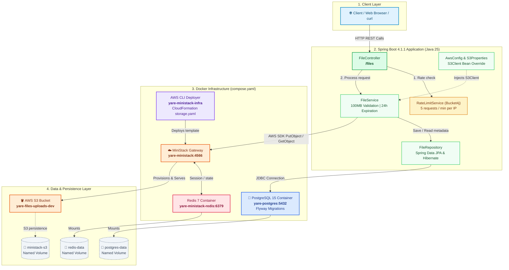

# Yare

Yare is an ephemeral file storage and sharing service backend built with **Spring Boot 4** and **Java 25**. It allows users to upload files with automatic 24-hour expiration, stream downloads with preserved filenames and MIME types, enforce file-size limits, and throttle traffic with client IP rate limiting.

For local development, Yare emulates AWS S3 and CloudFormation using **MiniStack** and **Docker Compose**, allowing full cloud-native prototyping without incurring live cloud infrastructure costs.

---

## Table of Contents

- [Features](#features)
- [Architecture](#architecture)
- [Technologies Used](#technologies-used)
- [API Reference](#api-reference)
- [Getting Started](#getting-started)
  - [Prerequisites](#prerequisites)
  - [Environment Configuration](#environment-configuration)
  - [Running the Local Infrastructure](#running-the-local-infrastructure)
  - [Running the Application](#running-the-application)
- [Testing](#testing)
- [Roadmap](#roadmap)

---

## Features

- **Object Storage via S3 API:** Uploads and streams files to an S3-compatible backend using the AWS SDK for Java v2.
- **Reproducible Infrastructure as Code:** Provisions the S3 bucket via an AWS CloudFormation template (`infra/storage.yaml`) automatically on startup.
- **Local AWS Emulation:** Emulates AWS S3 and CloudFormation locally with MiniStack and Redis; zero cloud charges during development.
- **File Validation & Constraints:** Enforces a maximum file size limit of 100 MB per upload.
- **Rate Limiting:** Protects API endpoints using an in-memory Token Bucket algorithm via Bucket4j (5 requests/minute per client IP).
- **Relational Metadata Tracking:** Preserves file metadata, UUID keys, and expiration timestamps in PostgreSQL 15.
- **Automated Database Migrations:** Uses Flyway for version-controlled database schema management.

---

## Architecture

Yare uses a tiered design that isolates HTTP handling, application logic, data persistence, and cloud storage:


---

## Technologies Used

| Category | Technology | Description |
| :--- | :--- | :--- |
| **Language & Platform** | Java 25 | Latest language features and modern JVM toolchain. |
| **Framework** | Spring Boot 4.1.1 | Spring MVC, Spring Data JPA, and DevTools. |
| **Build Tool** | Gradle | Configured using Kotlin DSL (`build.gradle.kts`). |
| **Database** | PostgreSQL 15 | Relational storage for file metadata and timestamps. |
| **Database Migrations** | Flyway | Automated versioned schema migrations. |
| **Cloud Storage SDK** | AWS SDK for Java v2 (2.48.0) | `software.amazon.awssdk:s3` for object operations. |
| **Cloud Emulation** | MiniStack (`ministackorg/ministack`) | Local S3 and CloudFormation emulation. |
| **Cache & State Store** | Redis 7 Alpine | Backend state store for MiniStack metadata. |
| **Infrastructure as Code**| AWS CloudFormation | `infra/storage.yaml` for declaring bucket infrastructure. |
| **Container Orchestration**| Docker & Docker Compose | Containerized local environment lifecycle management. |
| **Rate Limiting** | Bucket4j 8.10.1 | Token-bucket rate limiter per client IP address. |
| **Boilerplate Reduction**| Project Lombok | Eliminates getter, setter, and constructor boilerplate. |

---

## API Reference

Base Path: `/files`

### 1. Upload File
Uploads a file to S3 and records its metadata with a 24-hour expiration time.

- **Method:** `POST`
- **URL:** `/files`
- **Content-Type:** `multipart/form-data`
- **Body Parameters:**
  - `fileUpload` (file, required): Binary file to upload (maximum 100 MB).

**Example Request:**
```bash
curl -X POST http://localhost:8080/files \
  -F "fileUpload=@sample.pdf"
```

**Response (`201 Created`):**
```json
{
  "fileName": "sample.pdf",
  "fileUrl": "http://localhost:4566/d6f4b93b-01a2-4bb3-a3d8-5541bf636b1d",
  "expiresAt": "2026-09-21T21:00:00Z"
}
```

**Status Codes:**
- `201 Created`: File uploaded successfully.
- `400 Bad Request`: I/O error while reading the multipart file.
- `413 Payload Too Large`: Uploaded file exceeds the 100 MB limit.
- `429 Too Many Requests`: Client exceeded 5 requests per minute.
- `500 Internal Server Error`: Server or S3 processing issue.

---

### 2. Get File Metadata
Retrieves stored database metadata for a file by its ID.

- **Method:** `GET`
- **URL:** `/files/{id}`

**Example Request:**
```bash
curl -X GET http://localhost:8080/files/1
```

**Response (`200 OK`):**
```json
{
  "id": 1,
  "fileName": "sample.pdf",
  "objectKey": "d6f4b93b-01a2-4bb3-a3d8-5541bf636b1d",
  "fileUrl": "http://localhost:4566/d6f4b93b-01a2-4bb3-a3d8-5541bf636b1d",
  "expiresAt": "2026-09-21T21:00:00Z",
  "createdAt": "2026-09-20T21:00:00Z"
}
```

**Status Codes:**
- `200 OK`: File found.
- `404 Not Found`: No file matches the given ID.
- `429 Too Many Requests`: Rate limit exceeded.

---

### 3. Download File
Streams the file directly from S3 storage with original filename and MIME type headers.

- **Method:** `GET`
- **URL:** `/files/{id}/download`

**Example Request:**
```bash
curl -O -J http://localhost:8080/files/1/download
```

**Response Headers:**
- `Content-Type`: MIME type of the original file (e.g. `application/pdf`)
- `Content-Length`: Size of the file in bytes
- `Content-Disposition`: `attachment; filename="sample.pdf"`

---

## Getting Started

### Prerequisites

- **Java Development Kit (JDK):** Version 25
- **Docker & Docker Compose:** Installed and running

### Environment Configuration

Copy `.env.example` to `.env` in the project root:

```bash
cp .env.example .env
```

Default local configuration:
```properties
DATABASE_NAME=yare
DATABASE_USER=admin
DATABASE_PASSWORD=password
DATABASE_PORT=5432

AWS_S3_ENDPOINT=http://localhost:4566
AWS_S3_REGION=ap-southeast-1
AWS_S3_BUCKET=yare-files-uploads-dev-ap-southeast-1
AWS_ACCESS_KEY_ID=test
AWS_SECRET_ACCESS_KEY=test
```

### Running the Local Infrastructure

Start PostgreSQL, Redis, MiniStack, and the CloudFormation deployer:

```bash
docker compose up -d
```

Check the health status of all services:
```bash
docker compose ps
```

The `yare-ministack-infra` container will automatically run `aws cloudformation deploy` against MiniStack to provision the target S3 bucket specified in `infra/storage.yaml`.

### Running the Application

Once the Docker services are healthy, run the Spring Boot application using the Gradle wrapper:

**Linux / macOS:**
```bash
./gradlew bootRun
```

**Windows:**
```powershell
.\gradlew.bat bootRun
```

The application will start on port `8080`.

---

## Testing

Run unit and integration tests via Gradle:

```bash
./gradlew test
```

---

## Roadmap

- [x] S3 integration and local MiniStack emulation
- [x] Automated CloudFormation bucket deployment
- [x] File size limits (100 MB) and Bucket4j IP rate limiting
- [x] Project documentation and architecture diagrams
- [ ] Automated TTL cleanup / file expiration scheduler in PostgreSQL and S3
- [ ] Malware and antivirus file scanning
- [ ] CI/CD pipeline
- [ ] Web frontend
